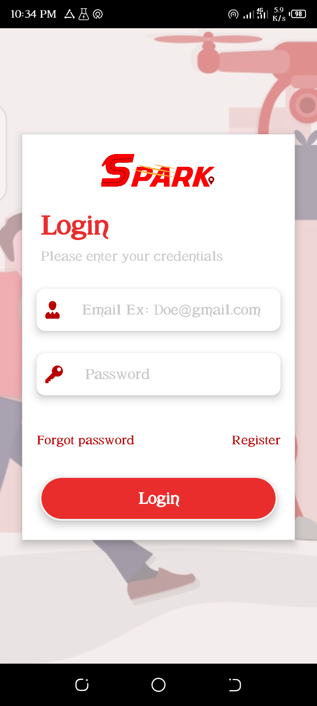

# spark


Spark is logistics and transportation mobile base application designed by me, using React-Native a hybrid mobile application library developed by Facebook and Express, a nodeJS framework. This app will provide ease of movement of goods and services, from p2p,p2m and m2p in deferent locations.

## Tech Stack

**Client:** React-Native, Redux, Expo

**Server:** NodeJS, MongoDB, ExpressJS


# How to Install & test the React Native App

```bash
git clone https://github.com/peterchijioke/spark.git
cd spark
yarn install
expo start
```


# Screenshots


